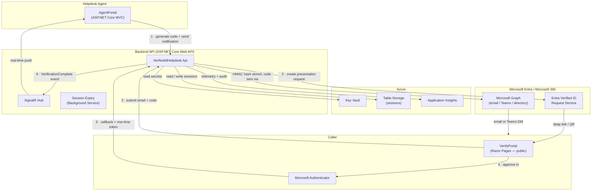
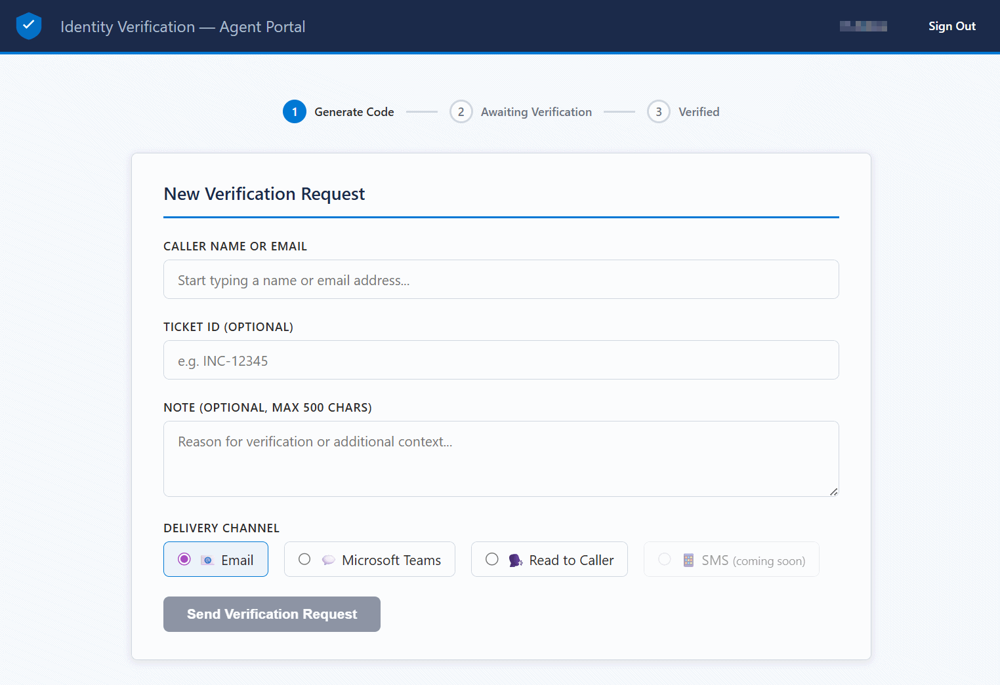
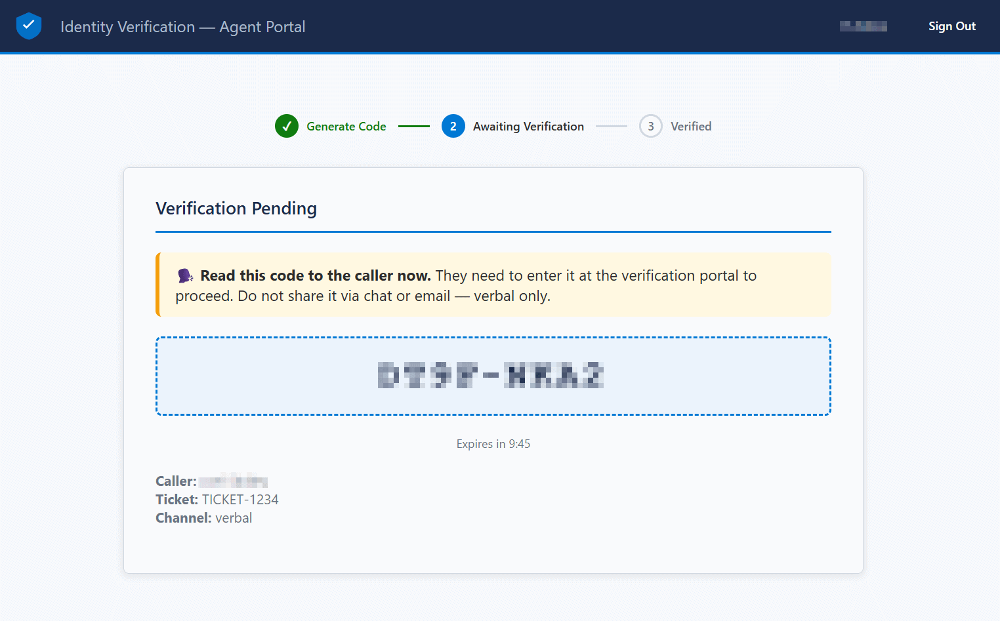
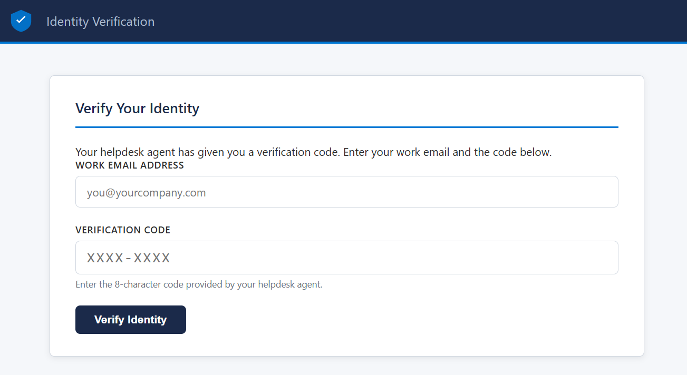

# Entra Verified ID Helpdesk Sample App

[](https://github.com/joelst/entra-verified-id-helpdesk/actions/workflows/build.yml)
[](LICENSE)

<a href="https://portal.azure.com/#create/Microsoft.Template/uri/https%3A%2F%2Fraw.githubusercontent.com%2Fjoelst%2Fentra-verified-id-helpdesk%2Fmain%2Finfra%2Fazuredeploy.json/createUIDefinitionUri/https%3A%2F%2Fraw.githubusercontent.com%2Fjoelst%2Fentra-verified-id-helpdesk%2Fmain%2Finfra%2FcreateUiDefinition.json" target="_blank" rel="noopener noreferrer"></a>

> [!IMPORTANT]
> **This is a sample / demo application.** It is provided as-is, without warranty or support of any kind, by the author or Microsoft. It has not been reviewed or certified for production use. If you deploy this in a production environment, you are responsible for having the code reviewed by qualified developers and security experts, adding appropriate network controls (such as Azure Application Gateway, Web Application Firewall, and private endpoints), and ensuring it meets your organization's security, compliance, and operational requirements. Use at your own risk.

A .NET 10 sample showing how a helpdesk team can verify caller identity using [Microsoft Entra Verified ID](https://learn.microsoft.com/en-us/entra/verified-id/decentralized-identifier-overview). When an employee calls the helpdesk, an agent generates an 8-character one-time code and delivers it by email, Microsoft Teams, or by reading it to the caller. The caller opens a public web page, enters their email and the code, then approves a credential presentation in Microsoft Authenticator. The agent sees the verified identity — name, employee ID, department — appear in real time via SignalR, without ever asking the caller a security question.

## Contents

| Setup                                                            | Reference                                           |
| ---------------------------------------------------------------- | --------------------------------------------------- |
| [Prerequisites](#prerequisites)                                  | [Configuration Reference](#configuration-reference) |
| [Entra Verified ID Setup](#entra-verified-id-setup)              | [Security Model](#security-model)                   |
| [Quick Start: Local Development](#quick-start-local-development) | [Customization Guide](#customization-guide)         |
| [Quick Start: Deploy to Azure](#quick-start-deploy-to-azure)     | [Project Structure](#project-structure)             |
| [Entra App Registration](#entra-app-registration-setup)          | [Contributing](#contributing)                       |

## Documentation Map

- [Configuration Reference](docs/app-settings.md) - app settings, constants, deployment parameters, and per-app configuration requirements
- [Fork and Deploy](docs/fork-and-deploy.md) - how to fork the repo, rename resources, update branding, and deploy your own copy
- [Secrets Rotation](docs/secrets-rotation.md) - rotate the HMAC key and Entra client certificate safely
- [Troubleshooting](docs/troubleshooting.md) - common deployment, sign-in, callback, and notification issues

## Architecture



## Features

- **Zero-knowledge for agent** — the agent sees a verified identity claim from Authenticator, never asks for passwords or security answers
- **One-time codes** — 8-character alphanumeric code, HMAC-SHA256 hashed at rest, expires in 10 minutes
- **Multiple delivery channels** — email, Microsoft Teams, and read-to-caller / verbal delivery (SMS extensible via `INotificationService`)
- **Real-time updates** — SignalR pushes the verification result to the agent as soon as the callback arrives
- **Group-based access control** — only members of a configured Entra security group can access the Agent Portal
- **Large-group overage handling** — if a user belongs to >200 groups (token groups claim truncated), the app falls back to a Graph API membership check automatically
- **Cryptographically secure** — uses `RandomNumberGenerator`; never `System.Random`
- **All secrets in Key Vault** — Managed Identity only; no credentials in code, config, or environment variables
- **Per-request callback authentication** — every presentation request gets a one-time callback token hashed at rest and validated on callback alongside the Verified ID `requestId`
- **Optional strict receipt JWT validation** — successful `presentation_verified` callbacks can additionally require a valid `receipt.id_token` when your tenant/wallet combination is known to supply it reliably
- **Rate limiting and session caps** — public endpoints are rate-limited, sessions use a lockout threshold, and each agent is limited to 3 concurrent pending verifications
- **Idempotent callbacks** — duplicate webhook deliveries are safely ignored
- **Session expiry background job** — marks stale sessions as `expired` every 2 minutes
- **Full audit trail** — structured log events (`code_generated`, `verification_initiated`, `verification_completed`, `code_expired`) sent to Application Insights

## Screenshots

### Agent Portal: New Verification Request



### Agent Portal: Verification Pending



### Verify Portal: Enter Email and Code



## Prerequisites

Before you start, make sure you have the following in place:

- [.NET 10 SDK](https://dotnet.microsoft.com/download/dotnet/10.0)
- [Azure CLI](https://learn.microsoft.com/en-us/cli/azure/install-azure-cli) — run `az login` before any of the steps below
- An Azure subscription
- **Microsoft Entra Verified ID** configured for your tenant — follow [Set up a tenant for Microsoft Entra Verified ID](https://learn.microsoft.com/en-us/entra/verified-id/verifiable-credentials-configure-tenant) if you have not done this yet
- An Entra **security group** whose members are your helpdesk agents — note the group **Object ID**

## Entra Verified ID Setup

This sample requires a configured Entra Verified ID tenant with an **employee credential type** defined. If you have not set this up yet, follow:

1. [Set up a tenant for Microsoft Entra Verified ID](https://learn.microsoft.com/en-us/entra/verified-id/verifiable-credentials-configure-tenant)
2. [Configure a custom credential](https://learn.microsoft.com/en-us/entra/verified-id/how-to-customize-credentials)
3. Set `VerifiedId:DidAuthority` to your DID (e.g., `did:web:yourdomain.com`) and `VerifiedId:CredentialType` to the name of your credential type

> **Local testing tip:** Use a separate dev credential type so test presentations do not appear in production audit logs.

## Quick Start: Local Development

If you plan on working with this sample locally, follow these steps.

### 1. Clone the repository

```bash
git clone https://github.com/joelst/entra-verified-id-helpdesk.git
cd entra-verified-id-helpdesk
```

### 2. Create a dev Key Vault

The app registration script needs a Key Vault to exist before it can create the certificate. Create one now:

```powershell
# PowerShell — create resource group, Key Vault, and grant yourself access
az group create --name rg-vidhelp-dev --location eastus
az keyvault create --name kv-verified-id-app-dev --resource-group rg-vidhelp-dev --location eastus --enable-rbac-authorization true

$myId    = az ad signed-in-user show --query id -o tsv
$kvScope = az keyvault show --name kv-verified-id-app-dev --query id -o tsv
az role assignment create --role "Key Vault Secrets Officer"      --assignee $myId --scope $kvScope
az role assignment create --role "Key Vault Certificates Officer" --assignee $myId --scope $kvScope
```

```bash
# bash / macOS
az group create --name rg-vidhelp-dev --location eastus
az keyvault create --name kv-verified-id-app-dev --resource-group rg-vidhelp-dev --location eastus --enable-rbac-authorization true

MY_ID="$(az ad signed-in-user show --query id -o tsv)"
KV_SCOPE="$(az keyvault show --name kv-verified-id-app-dev --query id -o tsv)"
az role assignment create --role "Key Vault Secrets Officer"      --assignee "$MY_ID" --scope "$KV_SCOPE"
az role assignment create --role "Key Vault Certificates Officer" --assignee "$MY_ID" --scope "$KV_SCOPE"
```

> **Portal alternative:** In the [Azure Portal](https://portal.azure.com), search for **Key Vaults** → **+ Create**. Enable **Azure role-based access control (RBAC)** on the *Access configuration* tab. After creation, go to **Access Control (IAM)** → **Add role assignment** and grant yourself both **Key Vault Secrets Officer** and **Key Vault Certificates Officer**.

> **Note:** RBAC role assignments can take 1–2 minutes to propagate. If the next step fails with a permissions error, wait a moment and retry.

### 3. Create the Entra app registration

The quickest path is the automated PowerShell script — it creates the certificate in Key Vault, registers it with the app, and configures your local dev environment in one step. See [Entra App Registration Setup](#entra-app-registration-setup) for manual steps and advanced options.

```powershell
.\scripts\New-AppRegistration.ps1 -KeyVaultName kv-verified-id-app-dev
```

The script:

- Creates an app registration and service principal
- Creates an RSA certificate in Key Vault
- Uploads the certificate public key to the app registration
- Exports the certificate (with private key) as a `.pem` file to `~/.entra-vidhelp/EntraClientCert.pem`
- Runs `dotnet user-secrets` on both `Api` and `AgentPortal` projects so local dev uses the file directly (no live Key Vault connection required on startup)

> **Security note:** The exported `.pem` file contains the private key. Keep it secure and never commit it to source control.

At the end you will have:

- **Application (client) ID** — used in `appsettings.json` / App Service settings
- **Directory (tenant) ID** — used in `appsettings.json` / App Service settings
- **Certificate** — created and stored in Key Vault as `EntraClientCert`; local copy at `~/.entra-vidhelp/EntraClientCert.pem`

### 4. Store the HMAC key in Key Vault

```powershell
# Generate and store a random HMAC key (PowerShell — no Python required)
$hmacKey = [Convert]::ToBase64String(
    [System.Security.Cryptography.RandomNumberGenerator]::GetBytes(32))
az keyvault secret set --vault-name kv-verified-id-app-dev --name HmacKey --value $hmacKey
```

```bash
# bash / macOS alternative
az keyvault secret set --vault-name kv-verified-id-app-dev --name HmacKey \
  --value "$(python3 -c 'import secrets,base64; print(base64.b64encode(secrets.token_bytes(32)).decode())')"
```

### 5. Configure appsettings

Point each project at your Key Vault using .NET user secrets:

```shell
# Works on Windows, Mac, and Linux — run from the repo root
dotnet user-secrets set "KeyVault:Uri" "https://kv-verified-id-app-dev.vault.azure.net/" --project src/VerifiedIdHelpdesk.Api
dotnet user-secrets set "KeyVault:Uri" "https://kv-verified-id-app-dev.vault.azure.net/" --project src/VerifiedIdHelpdesk.AgentPortal
dotnet user-secrets set "KeyVault:Uri" "https://kv-verified-id-app-dev.vault.azure.net/" --project src/VerifiedIdHelpdesk.VerifyPortal
```

Then open `appsettings.json` (or `appsettings.Development.json`) in each project and fill in the values from your app registration and Verified ID setup. For the full key list and per-application breakdown, use [docs/app-settings.md](docs/app-settings.md).

> **Note:** `DefaultAzureCredential` automatically picks up your `az login` session in local development. No additional environment variables are required.

### 6. (Optional) Expose a tunnel for Verified ID callbacks

Entra Verified ID needs to reach your local API to deliver presentation results. Use a tunneling tool such as [dev tunnels](https://learn.microsoft.com/en-us/azure/developer/dev-tunnels/overview) or ngrok to create a public HTTPS URL, then update `Api:BaseUrl` in your configuration with that URL.

### 7. Run all three apps

Open three terminal windows:

```bash
# Terminal 1 — Backend API (default port 5001)
dotnet run --project src/VerifiedIdHelpdesk.Api

# Terminal 2 — Agent Portal (default port 5002)
dotnet run --project src/VerifiedIdHelpdesk.AgentPortal

# Terminal 3 — Verify Portal (default port 5003)
dotnet run --project src/VerifiedIdHelpdesk.VerifyPortal
```

Navigate to the URLs shown in each terminal's output.

## Quick Start: Deploy to Azure

### Option A: One-click via the Azure Portal

The **Deploy to Azure** badge at the top of this page opens the Azure Portal deployment wizard. The wizard is a 4-step guided form.

**Recommended order:**

| Step | What you do                                                     | Requires                           |
| ---- | --------------------------------------------------------------- | ---------------------------------- |
| 1    | Run `New-AppRegistration.ps1 -SkipCert`                         | Azure CLI, Entra Global/App Admin  |
| 2    | Deploy infrastructure via portal (enter `clientId` from step 1) | Azure portal access                |
| 3    | Run `Set-AppCertificate.ps1`                                    | Azure CLI, KV just deployed        |
| 4    | Run `Grant-ManagedIdentityPermissions.ps1`                      | Azure CLI, Global/Priv. Role Admin |
| 5    | Store the HMAC key                                              | Azure CLI                          |

#### Step 1: Create the Entra app registration

Run this **before** deploying infrastructure so you have the `clientId` ready for the portal wizard. The `-SkipCert` flag skips Key Vault (which doesn't exist yet):

```powershell
$suffix = "helpdesk-prod"   # pick your deployment suffix
.\scripts\New-AppRegistration.ps1 `
    -AgentPortalUrl "https://app-agents-$suffix.azurewebsites.net" `
    -SkipCert
```

The script prints your **Tenant ID** and **Application (client) ID** — copy them for step 2.

> [!NOTE]
> The `-AgentPortalUrl` parameter sets the OIDC redirect URI on the app registration. Only the **Agent Portal** uses OIDC — the API uses JWT bearer tokens and the Verify Portal has no authentication. If you later add a custom domain to the Agent Portal, add the redirect URI manually in Entra admin center → App registrations → your app → **Authentication**.

#### Step 2: Deploy the infrastructure

1. Click the **Deploy to Azure** badge at the top of this page (or <a href="https://portal.azure.com/#create/Microsoft.Template/uri/https%3A%2F%2Fraw.githubusercontent.com%2Fjoelst%2Fentra-verified-id-helpdesk%2Fmain%2Finfra%2Fazuredeploy.json/createUIDefinitionUri/https%3A%2F%2Fraw.githubusercontent.com%2Fjoelst%2Fentra-verified-id-helpdesk%2Fmain%2Finfra%2FcreateUiDefinition.json" target="_blank" rel="noopener noreferrer">use this direct link</a>)

2. **Basics tab** — select your subscription, resource group, and region. Enter the same suffix you used in step 1 (e.g. `helpdesk-prod`). The Key Vault will be named `kv-<suffix>`.

3. **Infrastructure tab** — choose the App Service plan SKU, storage redundancy, and the IP range that may reach the Agent Portal (your corporate egress IP). Defaults are suitable for dev/test.

> [!NOTE]
> If the deployment fails with a quota error (e.g. `SubscriptionIsOverQuotaForSku`), your subscription may not have capacity for the selected SKU in that region. Try a different region, choose a different SKU tier, or request a quota increase. The new [App Service self-service quota experience](https://techcommunity.microsoft.com/blog/appsonazureblog/announcing-the-public-preview-of-the-new-app-service-quota-self-service-experien/4450415) lets you request increases directly from the portal without opening a support ticket.

4. **Entra App Registration tab** — enter the **Client ID** and **Tenant ID** from step 1. Enter the Object ID of the Entra group whose members are allowed to use the Agent Portal. (Both fields can be left blank and updated later if needed.)

5. **Verified ID tab** — enter your credential type name and DID authority (from your Entra Verified ID setup).

6. **Notifications tab** — enter the sender email address and Graph Object ID of the user account that sends Teams/email notifications.

7. Click **Review + create**, then **Create** and wait for the deployment to complete.

The deployment provisions all Azure resources (App Service plan, 3 App Services, **Key Vault**, Storage Account, Application Insights), assigns all Managed Identity RBAC roles, configures all non-secret app settings, and **automatically pulls and builds the application code from this GitHub repository using Oryx** — no separate code deployment step is needed.

#### Step 3: Add the certificate to Key Vault

Now that the Key Vault exists, create the certificate and register it with the app registration:

```powershell
$suffix   = "helpdesk-prod"
$clientId = "<client-id from step 1>"

.\scripts\Set-AppCertificate.ps1 `
    -KeyVaultName "kv-$suffix" `
    -AppId $clientId
```

The script creates a self-signed certificate inside Key Vault (private key never leaves KV), registers the public key with the app registration, and optionally exports a PEM file for local development.

#### Step 4: Grant Graph permissions to managed identities

The app registration only has Verified ID permissions. Graph permissions are granted directly to the App Service managed identities (least-privilege):

```powershell
.\scripts\Grant-ManagedIdentityPermissions.ps1 `
    -ResourceGroupName "<your-resource-group>" `
    -Suffix "$suffix"
```

This grants:
- **AgentPortal**: `User.Read.All`, `GroupMember.Read.All` (directory search, group membership checks)
- **API**: `User.Read.All`, `Mail.Send`, `Chat.Create`, `Chat.ReadWrite.All` (notifications)

#### Step 5: Store the HMAC key

Generate and store the HMAC key (used to sign one-time codes):

```powershell
# PowerShell (no Python required)
$hmacKey = [Convert]::ToBase64String(
    [System.Security.Cryptography.RandomNumberGenerator]::GetBytes(32))
az keyvault secret set --vault-name "kv-<suffix>" --name HmacKey --value $hmacKey
```

```bash
# bash / macOS alternative
az keyvault secret set --vault-name "kv-<suffix>" --name HmacKey \
  --value "$(python3 -c 'import secrets,base64; print(base64.b64encode(secrets.token_bytes(32)).decode())')"
```

#### Step 6: Application code

**No action required.** The infrastructure deployment in Step 2 automatically pulls the latest code from the `main` branch of this repository and builds it using [Oryx](https://github.com/microsoft/Oryx). All three App Services (API, Agent Portal, Verify Portal) are built and started automatically.

> [!NOTE]
> The first build takes a few minutes after the deployment completes. If the apps return a startup error initially, wait 2–3 minutes and refresh. You can monitor progress in the Azure Portal under each App Service → **Deployment Center → Logs**.

**To re-deploy after a code change** (e.g. after updating configuration), go to the Azure Portal → App Service → **Deployment Center → Sync**, or re-run the deployment using the **Redeploy** button. Alternatively, run the following CLI commands:

```powershell
# PowerShell — trigger a re-deploy (Oryx re-pulls and rebuilds from GitHub)
$suffix = "helpdesk-prod"
$rg     = "rg-<your-resource-group>"

az webapp deployment source sync -g $rg -n "app-api-$suffix"
az webapp deployment source sync -g $rg -n "app-agents-$suffix"
az webapp deployment source sync -g $rg -n "app-verify-$suffix"
```

<details>
<summary>Manual deploy fallback (if Oryx is not working)</summary>

If you need to deploy manually instead of relying on Oryx, build and push each app:

```powershell
# PowerShell
$suffix = "helpdesk-prod"
$rg     = "rg-<your-resource-group>"

dotnet publish src/VerifiedIdHelpdesk.Api         -c Release -o ./publish/api
dotnet publish src/VerifiedIdHelpdesk.AgentPortal  -c Release -o ./publish/agents
dotnet publish src/VerifiedIdHelpdesk.VerifyPortal -c Release -o ./publish/verify

az webapp deploy -g $rg -n "app-api-$suffix"     --src-path ./publish/api
az webapp deploy -g $rg -n "app-agents-$suffix"  --src-path ./publish/agents
az webapp deploy -g $rg -n "app-verify-$suffix"  --src-path ./publish/verify
```

```bash
# bash / macOS
SUFFIX="helpdesk-prod"
RG="rg-<your-resource-group>"

dotnet publish src/VerifiedIdHelpdesk.Api         -c Release -o ./publish/api
dotnet publish src/VerifiedIdHelpdesk.AgentPortal  -c Release -o ./publish/agents
dotnet publish src/VerifiedIdHelpdesk.VerifyPortal -c Release -o ./publish/verify

az webapp deploy -g "$RG" -n "app-api-${SUFFIX}"     --src-path ./publish/api
az webapp deploy -g "$RG" -n "app-agents-${SUFFIX}"  --src-path ./publish/agents
az webapp deploy -g "$RG" -n "app-verify-${SUFFIX}"  --src-path ./publish/verify
```

</details>


---

### Option B: Azure CLI

**Recommended order:**

| Step | What you do                                               |
| ---- | --------------------------------------------------------- |
| 1    | Create Entra app registration (`-SkipCert`)               |
| 2    | Deploy infrastructure (Bicep) with `clientId` from step 1 |
| 3    | Add certificate to Key Vault (`Set-AppCertificate.ps1`)   |
| 4    | Grant Graph permissions to managed identities             |
| 5    | Store the HMAC key                                        |

#### Step 1: Create the Entra app registration

Run this **before** deploying infrastructure so you have the `clientId` ready for the Bicep parameters. `-SkipCert` skips Key Vault (which doesn't exist yet):

```powershell
$suffix = "helpdesk-prod"   # pick your deployment suffix
.\scripts\New-AppRegistration.ps1 `
    -AgentPortalUrl "https://app-agents-$suffix.azurewebsites.net" `
    -SkipCert
```

Note the **Tenant ID** and **Application (client) ID** printed by the script.

> [!NOTE]
> If you later add a **custom domain** to the Agent Portal, add the custom domain redirect URI to the app registration: Entra admin center → App registrations → your app → **Authentication** → add `https://<your-custom-domain>/signin-oidc`.

#### Step 2: Deploy infrastructure

```powershell
# PowerShell
az login
az account set --subscription "<your-subscription-id>"
az group create --name rg-vidhelp-prod --location eastus

az deployment group create `
  --resource-group rg-vidhelp-prod `
  --template-file infra/main.bicep `
  --parameters suffix=helpdesk-prod `
               tenantId=`<tenant-id from step 1`> `
               clientId=`<client-id from step 1`> `
               helpDeskGroupId=`<group-object-id`> `
               didAuthority=did:web:yourdomain.com `
               senderEmail=helpdesk@yourdomain.com `
               senderUserId=`<sender-object-id`> `
               skuName=P1v3 `
               storageRedundancy=Standard_ZRS
```

```bash
# bash / macOS
az login
az account set --subscription "<your-subscription-id>"
az group create --name rg-vidhelp-prod --location eastus

az deployment group create \
  --resource-group rg-vidhelp-prod \
  --template-file infra/main.bicep \
  --parameters suffix=helpdesk-prod \
               tenantId=<tenant-id from step 1> \
               clientId=<client-id from step 1> \
               helpDeskGroupId=<group-object-id> \
               didAuthority=did:web:yourdomain.com \
               senderEmail=helpdesk@yourdomain.com \
               senderUserId=<sender-object-id> \
               skuName=P1v3 \
               storageRedundancy=Standard_ZRS
```

The Bicep template creates all Azure resources (App Service plan, three App Services, **Key Vault** named `kv-helpdesk-prod`, Storage Account, Application Insights), assigns Managed Identity RBAC roles, sets all non-secret configuration, and **automatically pulls and builds the application code from GitHub using Oryx** — no separate code deployment step is needed.

> [!NOTE]
> If the deployment fails with `SubscriptionIsOverQuotaForSku`, your subscription does not have capacity for the chosen SKU in that region. Try a different `--location`, change `skuName` to a different tier (e.g. `S1` or `P0v3`), or use the [App Service self-service quota experience](https://techcommunity.microsoft.com/blog/appsonazureblog/announcing-the-public-preview-of-the-new-app-service-quota-self-service-experien/4450415) to request an increase without a support ticket.

#### Step 3: Add the certificate to Key Vault

Now that the Key Vault exists, create the certificate and register it with the app registration:

```powershell
$suffix   = "helpdesk-prod"
$clientId = "<client-id from step 1>"

.\scripts\Set-AppCertificate.ps1 `
    -KeyVaultName "kv-$suffix" `
    -AppId $clientId
```

#### Step 4: Grant Graph permissions to managed identities

```powershell
.\scripts\Grant-ManagedIdentityPermissions.ps1 `
    -ResourceGroupName rg-vidhelp-prod `
    -Suffix helpdesk-prod
```

#### Step 5: Set the HMAC key in Key Vault

```powershell
# PowerShell (no Python required)
$kvName = "kv-helpdesk-prod"   # matches your 'suffix' parameter
$hmacKey = [Convert]::ToBase64String(
    [System.Security.Cryptography.RandomNumberGenerator]::GetBytes(32))
az keyvault secret set --vault-name $kvName --name HmacKey --value $hmacKey
```

```bash
# bash / macOS alternative
KV_NAME="kv-helpdesk-prod"
az keyvault secret set --vault-name "$KV_NAME" --name HmacKey \
  --value "$(python3 -c 'import secrets,base64; print(base64.b64encode(secrets.token_bytes(32)).decode())')"
```

#### Step 6: Application code

**No action required.** The Bicep deployment in Step 2 automatically pulls and builds the application code from the `main` branch of this repository using Oryx. All three App Services start automatically after the build completes.

> [!NOTE]
> The first build takes a few minutes. If an app returns a startup error, wait 2–3 minutes and refresh. Monitor progress under each App Service → **Deployment Center → Logs**.

**To re-deploy** after a code change, run:

```powershell
# PowerShell — trigger Oryx re-pull and rebuild from GitHub
$SUFFIX = "helpdesk-prod"
$RG     = "rg-vidhelp-prod"

az webapp deployment source sync -g $RG -n "app-api-$SUFFIX"
az webapp deployment source sync -g $RG -n "app-agents-$SUFFIX"
az webapp deployment source sync -g $RG -n "app-verify-$SUFFIX"
```

```bash
# bash / macOS
SUFFIX="helpdesk-prod"
RG="rg-vidhelp-prod"

az webapp deployment source sync -g "$RG" -n "app-api-${SUFFIX}"
az webapp deployment source sync -g "$RG" -n "app-agents-${SUFFIX}"
az webapp deployment source sync -g "$RG" -n "app-verify-${SUFFIX}"
```

<details>
<summary>Manual deploy fallback (if Oryx is not working)</summary>

```powershell
# PowerShell
$SUFFIX = "helpdesk-prod"
$RG     = "rg-vidhelp-prod"

dotnet publish src/VerifiedIdHelpdesk.Api         -c Release -o ./publish/api
dotnet publish src/VerifiedIdHelpdesk.AgentPortal  -c Release -o ./publish/agents
dotnet publish src/VerifiedIdHelpdesk.VerifyPortal -c Release -o ./publish/verify

az webapp deploy -g $RG -n "app-api-$SUFFIX"     --src-path ./publish/api
az webapp deploy -g $RG -n "app-agents-$SUFFIX"  --src-path ./publish/agents
az webapp deploy -g $RG -n "app-verify-$SUFFIX"  --src-path ./publish/verify
```

```bash
# bash / macOS
SUFFIX="helpdesk-prod"
RG="rg-vidhelp-prod"

dotnet publish src/VerifiedIdHelpdesk.Api         -c Release -o ./publish/api
dotnet publish src/VerifiedIdHelpdesk.AgentPortal  -c Release -o ./publish/agents
dotnet publish src/VerifiedIdHelpdesk.VerifyPortal -c Release -o ./publish/verify

az webapp deploy -g "$RG" -n "app-api-${SUFFIX}"     --src-path ./publish/api
az webapp deploy -g "$RG" -n "app-agents-${SUFFIX}"  --src-path ./publish/agents
az webapp deploy -g "$RG" -n "app-verify-${SUFFIX}"  --src-path ./publish/verify
```

</details>


## Entra App Registration Setup

You can complete this section manually in the Entra portal or use the automated PowerShell scripts. Both produce the same result.

### Automated App Registration (two-script flow)

The app registration setup is split into two scripts so you can create the app registration **before** deploying infrastructure. The Key Vault is created by the Bicep deployment.

#### Script 1: `New-AppRegistration.ps1` — create the app registration

Creates the app registration, service principal, API permissions, admin consent, and group claims configuration. Use `-SkipCert` when Key Vault doesn't exist yet:

```powershell
# Step 1 of deployment — run BEFORE deploying infrastructure
.\scripts\New-AppRegistration.ps1 `
    -AgentPortalUrl "https://app-agents-<suffix>.azurewebsites.net" `
    -SkipCert
```

```powershell
# All options (run after infra if you want the cert created in the same step)
.\scripts\New-AppRegistration.ps1 `
    -DisplayName "Helpdesk Verified ID" `
    -AgentPortalUrl "https://app-agents-helpdesk-prod.azurewebsites.net" `
    -KeyVaultName kv-helpdesk-prod `
    -CertValidityMonths 36
```

**Requirements:**
- PowerShell 7+
- Azure CLI installed and signed in (`az login`)
- You must be a **Global Administrator** or **Privileged Role Administrator** to grant admin consent

When the script finishes, it prints your **Tenant ID** and **Client ID**.

#### Script 2: `Set-AppCertificate.ps1` — add the certificate

Creates a self-signed certificate in Key Vault and registers the public key with the app registration. Run this **after** the infrastructure deployment (which creates the Key Vault):

```powershell
# Step 3 of deployment — run AFTER deploying infrastructure
.\scripts\Set-AppCertificate.ps1 `
    -KeyVaultName kv-helpdesk-prod `
    -AppId "<client-id from New-AppRegistration.ps1>"
```

**Requirements:**
- Azure CLI installed and signed in
- Key Vault already exists (created by Bicep)
- You need **Key Vault Certificates Officer** role (the script assigns it automatically if you have Owner or User Access Administrator on the vault)

The private key is generated inside Key Vault and never leaves it. The script also exports a local PEM file for development if run on a developer workstation.

> **Note:** If the Entra Verified ID service principal has not yet been provisioned in your tenant (requires completing [Entra Verified ID Setup](#entra-verified-id-setup) first), the `VerifiableCredential.Create.All` permission must be added manually afterward. `New-AppRegistration.ps1` prints instructions if this is the case.

### Manual Setup

Follow these steps if you prefer to use the Entra portal.

### 1. Create the registration

1. In the Entra portal, navigate to **Microsoft Entra ID** → **App registrations** → **New registration**
2. Set a display name (e.g., `VerifiedID Helpdesk`)
3. Set **Supported account types** to **Single tenant**
4. Add a **Redirect URI** of type **Web**: `https://localhost:5002/signin-oidc` (add your production URL too)
5. Click **Register** and note the **Application (client) ID** and **Directory (tenant) ID**

### 2. Add API permissions

Navigate to **API permissions** → **Add a permission**:

| Permission                        | Type        | API                                    |
| --------------------------------- | ----------- | -------------------------------------- |
| `User.Read.All`                   | Application | Microsoft Graph                        |
| `GroupMember.Read.All`            | Application | Microsoft Graph                        |
| `Mail.Send`                       | Application | Microsoft Graph                        |
| `Chat.Create`                     | Application | Microsoft Graph                        |
| `Chat.ReadWrite.All`              | Application | Microsoft Graph                        |
| `VerifiableCredential.Create.All` | Application | Verifiable Credentials Service Request |

After adding all permissions, click **Grant admin consent for \<your tenant\>**.

### 3. Create a client certificate

Navigate to **Certificates & secrets** → **Certificates** → **Upload certificate**.

Upload the public key (`.cer` file) of a certificate whose private key is stored in Azure Key Vault. The recommended approach is to create the certificate directly in Key Vault:

```powershell
# PowerShell
$policy = az keyvault certificate get-default-policy
az keyvault certificate create --vault-name <kv-name> --name EntraClientCert --policy $policy
az keyvault certificate download --vault-name <kv-name> --name EntraClientCert `
  --file EntraClientCert.cer --encoding DER
```

```bash
# bash / macOS
az keyvault certificate create --vault-name <kv-name> --name EntraClientCert --policy \
  "$(az keyvault certificate get-default-policy)"
az keyvault certificate download --vault-name <kv-name> --name EntraClientCert \
  --file EntraClientCert.cer --encoding DER
```

Then upload `EntraClientCert.cer` in the portal. The private key never leaves Key Vault.

### 4. Enable group claims in the token

Without this step, the Agent Portal authorization will silently deny all agents.

1. Navigate to **Token configuration** → **Add groups claim**
2. Select **Security groups**
3. Check **Group ID** for both **ID token** and **Access token**
4. Click **Add**

Alternatively, add to the app registration **Manifest**:
```json
"groupMembershipClaims": "SecurityGroup"
```

### 5. Large-organization note (>200 groups)

If your agents belong to more than 200 Entra security groups, the `groups` claim will be omitted from the token (overage scenario). The application handles this automatically: when it detects the `_claim_names` overage indicator in the token, it falls back to a Microsoft Graph `checkMemberGroups` call. No configuration is needed — just ensure the `GroupMember.Read.All` application permission is granted.

## Configuration Reference

Use [docs/app-settings.md](docs/app-settings.md) for the complete settings matrix, constants, deployment parameters, and per-application breakdown. The summary below keeps the README focused on the values most teams touch first during setup and deployment.

All non-secret values can be supplied in three ways — ASP.NET Core reads all of them automatically:

| Environment           | How to set config                                                          |
| --------------------- | -------------------------------------------------------------------------- |
| **Local development** | `appsettings.Development.json` or `dotnet user-secrets`                    |
| **Azure App Service** | App Service **Application Settings** (exposed as environment variables)    |
| **Any environment**   | Environment variables (use `__` instead of `:` as the hierarchy separator) |

Secrets (`HmacKey`) are always read from Key Vault via Managed Identity regardless of environment. The app registration certificate (`EntraClientCert`) is created in Key Vault by the script and referenced via the `AzureAd:ClientCertificates` config block.

> **App Service note:** Set each key as an Application Setting with `__` replacing `:`.
> For example, `AzureAd:TenantId` becomes `AzureAd__TenantId`.
> For array settings, use numeric segments such as `Api__Scopes__0`.

### Commonly updated settings

| Setting group             | Typical keys                                                                                         | Why you set them                                                                                         |
| ------------------------- | ---------------------------------------------------------------------------------------------------- | -------------------------------------------------------------------------------------------------------- |
| **Key Vault**             | `KeyVault:Uri`                                                                                       | The main bootstrap setting. The apps use it to load secrets and certificate references at startup.       |
| **Entra ID**              | `AzureAd:TenantId`, `AzureAd:ClientId`, `AzureAd:CallbackPath`                                       | Connects the Agent Portal and API to your tenant and app registration.                                   |
| **Verified ID**           | `VerifiedId:TenantId`, `VerifiedId:ClientId`, `VerifiedId:DidAuthority`, `VerifiedId:CredentialType` | Points the API at your Entra Verified ID tenant and credential definition.                               |
| **Portal URLs**           | `AgentPortal:BaseUrl`, `VerifyPortal:BaseUrl`, `Api:BaseUrl`                                         | Needed for CORS, redirects, portal-to-API calls, and Verified ID callback URL construction.              |
| **Agent-to-API scopes**   | `Api:Scopes:0`                                                                                       | Required by AgentPortal when acquiring a downstream token. In App Service this becomes `Api__Scopes__0`. |
| **Authorization**         | `AuthorizationGroups:HelpDeskAgents`                                                                 | Restricts AgentPortal access to your helpdesk security group.                                            |
| **Notifications**         | `Notifications:SenderEmail`, `Notifications:SenderUserId`                                            | Identifies the mailbox / account used for email and Teams delivery.                                      |
| **Telemetry and storage** | `ApplicationInsights:ConnectionString`, `Storage:AccountUri`                                         | Enables diagnostics and points the API at Azure Table Storage.                                           |

> **Strict callback JWT mode:** `VerifiedId:RequireCallbackJwtValidation` is optional. Leave it `false` unless you have confirmed that successful `presentation_verified` callbacks in your tenant reliably include `receipt.id_token`.

### Key Vault secrets

| Secret / Certificate name | Value                                                                                                                                                               |
| ------------------------- | ------------------------------------------------------------------------------------------------------------------------------------------------------------------- |
| `EntraClientCert`         | Self-signed certificate created by `New-AppRegistration.ps1`. The private key is generated inside Key Vault and never exported.                                     |
| `HmacKey`                 | 32-byte cryptographically random value, base64-encoded. PowerShell: `[Convert]::ToBase64String([System.Security.Cryptography.RandomNumberGenerator]::GetBytes(32))` |

### Example: API App Service settings

The example below shows the API app. AgentPortal and VerifyPortal use different subsets of settings; use [docs/app-settings.md](docs/app-settings.md) for the per-application list.

```powershell
# PowerShell
$RG = "rg-vidhelp-prod"

az webapp config appsettings set --resource-group $RG --name app-api-helpdesk-prod --settings `
  AzureAd__TenantId="<tenant-id>" `
  AzureAd__ClientId="<client-id>" `
  KeyVault__Uri="https://kv-helpdesk-prod.vault.azure.net/" `
  VerifiedId__TenantId="<tenant-id>" `
  VerifiedId__ClientId="<client-id>" `
  VerifiedId__DidAuthority="did:web:yourdomain.com" `
  VerifiedId__CredentialType="EmployeeVerifiedCredential" `
  Storage__AccountUri="https://stmystorage.table.core.windows.net/" `
  AuthorizationGroups__HelpDeskAgents="<group-object-id>" `
  AgentPortal__BaseUrl="https://agents.yourdomain.com" `
  VerifyPortal__BaseUrl="https://verify.yourdomain.com" `
  Api__BaseUrl="https://api.yourdomain.com" `
  Notifications__SenderEmail="helpdesk@yourdomain.com" `
  Notifications__SenderUserId="<sender-object-id>"
```

```bash
# bash / macOS alternative
RG="rg-vidhelp-prod"

az webapp config appsettings set --resource-group $RG --name app-api-helpdesk-prod --settings \
  AzureAd__TenantId="<tenant-id>" \
  AzureAd__ClientId="<client-id>" \
  KeyVault__Uri="https://kv-helpdesk-prod.vault.azure.net/" \
  VerifiedId__TenantId="<tenant-id>" \
  VerifiedId__ClientId="<client-id>" \
  VerifiedId__DidAuthority="did:web:yourdomain.com" \
  VerifiedId__CredentialType="EmployeeVerifiedCredential" \
  Storage__AccountUri="https://stmystorage.table.core.windows.net/" \
  AuthorizationGroups__HelpDeskAgents="<group-object-id>" \
  AgentPortal__BaseUrl="https://agents.yourdomain.com" \
  VerifyPortal__BaseUrl="https://verify.yourdomain.com" \
  Api__BaseUrl="https://api.yourdomain.com" \
  Notifications__SenderEmail="helpdesk@yourdomain.com" \
  Notifications__SenderUserId="<sender-object-id>"
```

## Customization Guide

For repo renaming, branding, and deployment-specific customization beyond the quick edits below, see [docs/fork-and-deploy.md](docs/fork-and-deploy.md).

| What to change                           | Where                                                                                                                                                                                                  |
| ---------------------------------------- | ------------------------------------------------------------------------------------------------------------------------------------------------------------------------------------------------------ |
| **Color scheme**                         | Edit the `:root` block in `src/VerifiedIdHelpdesk.AgentPortal/wwwroot/css/theme.css` and the matching file in `VerifyPortal`. Every component reads from CSS variables — no other files need touching. |
| **Organization logo**                    | Replace `wwwroot/images/logo.svg` in both portals (SVG preferred; size it to render cleanly at roughly 160×48 px)                                                                                      |
| **Code length or expiry**                | Edit `src/VerifiedIdHelpdesk.Core/Constants.cs` — change `CodeLength` and/or `CodeExpiryMinutes`                                                                                                       |
| **Add a delivery channel (e.g., SMS)**   | Implement `INotificationService` in `src/VerifiedIdHelpdesk.Notifications/` and register it in the API's `Program.cs`                                                                                  |
| **Change the agent authorization group** | Update `AuthorizationGroups:HelpDeskAgents` in `appsettings.json` (or Key Vault if you prefer)                                                                                                         |
| **Renew the app certificate**            | Run `az keyvault certificate create --vault-name <kv> --name EntraClientCert --policy ...` to issue a new version, then upload the new public key in the portal under **Certificates & secrets**       |
| **Add a supervisor role**                | Add a new Entra group, add it to `AuthorizationGroups` in config, and add a new policy in `Program.cs` with `policy.RequireClaim("groups", ...)`                                                       |
| **Change session storage**               | Implement `ISessionStore` in `VerifiedIdHelpdesk.Infrastructure` (swap Azure Table Storage for Cosmos DB, SQL, etc.)                                                                                   |

## Security Model

This sample implements the following security controls. Do not relax these for a production deployment.

| #   | Control                                     | Implementation                                                                                                                                                                                                                                                                                                   |
| --- | ------------------------------------------- | ---------------------------------------------------------------------------------------------------------------------------------------------------------------------------------------------------------------------------------------------------------------------------------------------------------------- |
| 1   | **No plaintext codes at rest**              | Only `HMAC-SHA256(code, hmacKey)` is stored — see `CodeHasher.cs`                                                                                                                                                                                                                                                |
| 2   | **No plaintext codes in logs**              | Only `sessionId` is logged; the code never appears in any log event                                                                                                                                                                                                                                              |
| 3   | **Cryptographically random codes**          | `RandomNumberGenerator.GetBytes()` — never `System.Random` or `Guid`                                                                                                                                                                                                                                             |
| 4   | **Callback authentication and correlation** | Each presentation request gets a one-time callback token, only its hash is stored, the callback loads the session from `state`, pending-session callbacks must match the stored `requestId`, and strict `receipt.id_token` validation is available as an opt-in for successful `presentation_verified` callbacks |
| 5   | **Server-side expiry**                      | `ExpiresAt` (UTC) is compared to `DateTime.UtcNow` — client timestamps are ignored                                                                                                                                                                                                                               |
| 6   | **Invalidate on first use**                 | Session status is set to `verified` before returning the callback response                                                                                                                                                                                                                                       |
| 7   | **Secrets from Key Vault only**             | `DefaultAzureCredential` + Key Vault config provider; no secrets in appsettings or env vars                                                                                                                                                                                                                      |
| 8   | **HMAC key in memory only**                 | Retrieved once at startup via config provider; never written to disk or logs                                                                                                                                                                                                                                     |
| 9   | **Rate limiting and session caps**          | Public endpoints are rate-limited, each agent is limited to 3 concurrent pending sessions, and the session initiation lockout threshold is controlled by `MaxFailedAttempts`                                                                                                                                     |
| 10  | **HTTPS only**                              | `httpsOnly: true` on App Service + HSTS header (min 1 year)                                                                                                                                                                                                                                                      |
| 11  | **CORS restricted**                         | Backend API allows only the two portal origins — no wildcards                                                                                                                                                                                                                                                    |
| 12  | **Agent Portal IP-restricted**              | App Service access restriction via `corporateIpRange` Bicep parameter                                                                                                                                                                                                                                            |
| 13  | **Generic error messages**                  | Exception details, stack traces, and internal paths are never returned to callers                                                                                                                                                                                                                                |
| 14  | **Idempotent webhook handling**             | Duplicate callbacks are ignored if session status is already `verified`                                                                                                                                                                                                                                          |

> **AgentPortal auth note:** Keep `CookiePolicyOptions.MinimumSameSitePolicy = SameSiteMode.Unspecified`. OpenID Connect correlation and nonce cookies must be able to use `SameSite=None`, and forcing a global `Lax` or `Strict` minimum causes repeated sign-in prompts. Background polling endpoints should also avoid forcing interactive downstream-token challenges when the in-memory token cache is cold after an app restart.

## Project Structure

```
├── src/
│   ├── VerifiedIdHelpdesk.AgentPortal/     # ASP.NET Core 10 MVC — helpdesk agent UI
│   ├── VerifiedIdHelpdesk.VerifyPortal/    # ASP.NET Core 10 Razor Pages — public verify site
│   ├── VerifiedIdHelpdesk.Api/             # ASP.NET Core 10 Web API — backend orchestration
│   ├── VerifiedIdHelpdesk.Core/            # Domain models, interfaces, constants
│   ├── VerifiedIdHelpdesk.Infrastructure/  # Table Storage, Entra Verified ID client, code hashing
│   └── VerifiedIdHelpdesk.Notifications/   # Email and Teams notification adapters
├── tests/
│   ├── VerifiedIdHelpdesk.UnitTests/       # xUnit unit tests
│   └── VerifiedIdHelpdesk.IntegrationTests/
└── infra/
    ├── main.bicep                          # All Azure resources
    └── parameters.json                     # Deployment parameter values
```

## Related Samples and Documentation

- [Verifiable Credentials .NET samples](https://github.com/Azure-Samples/active-directory-verifiable-credentials-dotnet) — the upstream samples this project builds on
- [Microsoft Identity Web](https://github.com/AzureAD/microsoft-identity-web) — auth library used by Agent Portal and API
- [Group-based authorization in ASP.NET Core](https://github.com/Azure-Samples/active-directory-aspnetcore-webapp-openidconnect-v2/tree/master/5-WebApp-AuthZ) — pattern used for helpdesk agent access control
- [Microsoft Graph SDK for .NET](https://github.com/microsoftgraph/msgraph-sdk-dotnet) — directory search, email, Teams

## Contributing

This project welcomes contributions and suggestions. Most contributions require you to agree to a Contributor License Agreement (CLA) declaring that you have the right to, and actually do, grant us the rights to use your contribution.

Please open an issue before submitting a pull request for large changes, so we can discuss the design first.

This project has adopted the [Microsoft Open Source Code of Conduct](https://opensource.microsoft.com/codeofconduct/). For more information, see the [Code of Conduct FAQ](https://opensource.microsoft.com/codeofconduct/faq/).

## License

This project is licensed under the [MIT License](LICENSE).
