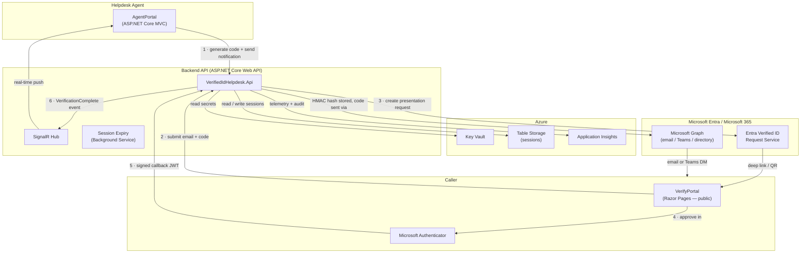

# Entra Verified ID Helpdesk

[](https://github.com/YOUR_ORG/entra-verified-id-helpdesk/actions/workflows/build.yml)

A .NET 10 sample showing how a helpdesk team can verify caller identity using [Microsoft Entra Verified ID](https://learn.microsoft.com/en-us/entra/verified-id/decentralized-identifier-overview). When an employee calls the helpdesk, an agent generates an 8-character one-time code and sends it by email or Microsoft Teams. The caller opens a public web page, enters their email and the code, then approves a credential presentation in Microsoft Authenticator. The agent sees the verified identity — name, employee ID, department — appear in real time via SignalR, without ever asking the caller a security question.

## Architecture



## Features

- **Zero-knowledge for agent** — the agent sees a verified identity claim from Authenticator, never asks for passwords or security answers
- **One-time codes** — 8-character alphanumeric code, HMAC-SHA256 hashed at rest, expires in 10 minutes
- **Multiple delivery channels** — email and Microsoft Teams (SMS extensible via `INotificationService`)
- **Real-time updates** — SignalR pushes the verification result to the agent as soon as the callback arrives
- **Group-based access control** — only members of a configured Entra security group can access the Agent Portal
- **Large-group overage handling** — if a user belongs to >200 groups (token groups claim truncated), the app falls back to a Graph API membership check automatically
- **Cryptographically secure** — uses `RandomNumberGenerator`; never `System.Random`
- **All secrets in Key Vault** — Managed Identity only; no credentials in code, config, or environment variables
- **Webhook signature validation** — every Entra Verified ID callback is validated as a signed JWT before touching the database
- **Rate limiting** — max 5 failed code attempts per session; max 3 concurrent pending sessions per agent
- **Idempotent callbacks** — duplicate webhook deliveries are safely ignored
- **Session expiry background job** — marks stale sessions as `expired` every 2 minutes
- **Full audit trail** — structured log events (`code_generated`, `verification_initiated`, `verification_completed`, `code_expired`) sent to Application Insights

## Prerequisites

- [.NET 10 SDK](https://dotnet.microsoft.com/download/dotnet/10.0)
- An Azure subscription with [Microsoft Entra Verified ID configured](https://learn.microsoft.com/en-us/entra/verified-id/verifiable-credentials-configure-tenant)
- [Azure CLI](https://learn.microsoft.com/en-us/cli/azure/install-azure-cli) (`az login` before running locally)
- An Entra app registration with the permissions listed in [App Registration Setup](#entra-app-registration-setup)
- An Entra security group whose members are your helpdesk agents (note the group **Object ID**)
- (Optional for local dev) A dev Azure Table Storage account and Key Vault

## Quick Start (Local Development)

### 1. Clone the repository

```bash
git clone https://github.com/YOUR_ORG/entra-verified-id-helpdesk.git
cd entra-verified-id-helpdesk
```

### 2. Create a dev Key Vault and set secrets

```bash
# Create a resource group and Key Vault for local dev
az group create --name rg-vidhelp-dev --location eastus
az keyvault create --name kv-vidhelp-dev --resource-group rg-vidhelp-dev --location eastus --enable-rbac-authorization true

# Grant yourself Key Vault Secrets Officer so you can set values
az role assignment create \
  --role "Key Vault Secrets Officer" \
  --assignee "$(az ad signed-in-user show --query id -o tsv)" \
  --scope "$(az keyvault show --name kv-vidhelp-dev --query id -o tsv)"

# Set required secrets
az keyvault secret set --vault-name kv-vidhelp-dev --name EntraClientSecret --value "<your-app-client-secret>"
az keyvault secret set --vault-name kv-vidhelp-dev --name HmacKey --value "$(python3 -c 'import secrets,base64; print(base64.b64encode(secrets.token_bytes(32)).decode())')"
```

### 3. Create an app registration

See [Entra App Registration Setup](#entra-app-registration-setup) below.

### 4. Configure appsettings

Copy `appsettings.json` values into `appsettings.Development.json` for each project and fill in the real values — or set them as user secrets:

```bash
# From the repo root
dotnet user-secrets set "KeyVault:Uri" "https://kv-vidhelp-dev.vault.azure.net/" \
  --project src/VerifiedIdHelpdesk.Api

dotnet user-secrets set "KeyVault:Uri" "https://kv-vidhelp-dev.vault.azure.net/" \
  --project src/VerifiedIdHelpdesk.AgentPortal

dotnet user-secrets set "KeyVault:Uri" "https://kv-vidhelp-dev.vault.azure.net/" \
  --project src/VerifiedIdHelpdesk.VerifyPortal
```

> **Important:** The `DefaultAzureCredential` used to read Key Vault picks up your `az login` credentials automatically in local development. No additional environment variables are needed.

### 5. Run all three apps

Open three terminal windows:

```bash
# Terminal 1 — Backend API (default port 5001)
dotnet run --project src/VerifiedIdHelpdesk.Api

# Terminal 2 — Agent Portal (default port 5002)
dotnet run --project src/VerifiedIdHelpdesk.AgentPortal

# Terminal 3 — Verify Portal (default port 5003)
dotnet run --project src/VerifiedIdHelpdesk.VerifyPortal
```

Then navigate to the URLs shown in each terminal's output.

> **Tip:** For Entra Verified ID to call back to your local API, expose it with a tunneling tool such as [dev tunnels](https://learn.microsoft.com/en-us/azure/developer/dev-tunnels/overview) or ngrok, and update `VerifyPortal:BaseUrl` + the callback URL accordingly.

## Configuration Reference

All non-secret values live in `appsettings.json` (or `appsettings.Development.json` for local overrides). Secrets are read from Key Vault at startup.

### appsettings.json keys

| Key | Description |
|-----|-------------|
| `AzureAd:Instance` | Always `https://login.microsoftonline.com/` |
| `AzureAd:TenantId` | Your Entra tenant ID (GUID) |
| `AzureAd:ClientId` | App registration client ID (GUID) |
| `AzureAd:CallbackPath` | OIDC redirect path — leave as `/signin-oidc` |
| `KeyVault:Uri` | Full URI of your Key Vault, e.g. `https://kv-my-vault.vault.azure.net/` |
| `VerifiedId:TenantId` | Entra tenant ID — same as `AzureAd:TenantId` |
| `VerifiedId:ClientId` | App registration client ID — same as `AzureAd:ClientId` |
| `VerifiedId:DidAuthority` | Your DID, e.g. `did:web:yourdomain.com` |
| `VerifiedId:CredentialType` | Verifiable credential type name, e.g. `EmployeeVerifiedCredential` |
| `VerifiedId:RequestServiceBaseUrl` | Always `https://verifiedid.did.msidentity.com/v1.0/` |
| `Storage:AccountUri` | Azure Table Storage endpoint, e.g. `https://stmystorage.table.core.windows.net/` |
| `AuthorizationGroups:HelpDeskAgents` | Object ID of the Entra security group for helpdesk agents |
| `AgentPortal:BaseUrl` | Public base URL of the Agent Portal, e.g. `https://agents.yourdomain.com` |
| `VerifyPortal:BaseUrl` | Public base URL of the Verify Portal, e.g. `https://verify.yourdomain.com` |
| `Api:BaseUrl` | Public base URL of the Backend API, e.g. `https://api.yourdomain.com` |
| `Notifications:SenderEmail` | UPN of the mailbox used to send email notifications |
| `Notifications:SenderUserId` | Object ID of the sender's Entra user account |
| `ApplicationInsights:ConnectionString` | App Insights connection string (non-secret) |

### Key Vault secrets

| Secret name | Value |
|-------------|-------|
| `EntraClientSecret` | App registration client secret. **For production, use a certificate instead** — see [Microsoft docs](https://learn.microsoft.com/en-us/entra/identity-platform/certificate-credentials). |
| `HmacKey` | 32-byte cryptographically random value, base64-encoded. Generate with: `python3 -c 'import secrets,base64; print(base64.b64encode(secrets.token_bytes(32)).decode())'` |

## Entra App Registration Setup

### 1. Create the registration

1. In the Azure portal, navigate to **Microsoft Entra ID** → **App registrations** → **New registration**
2. Set a display name (e.g., `VerifiedID Helpdesk`)
3. Set **Supported account types** to **Single tenant**
4. Add a **Redirect URI** of type **Web**: `https://localhost:5002/signin-oidc` (add your production URL too)
5. Click **Register** and note the **Application (client) ID** and **Directory (tenant) ID**

### 2. Add API permissions

Navigate to **API permissions** → **Add a permission**:

| Permission | Type | API |
|------------|------|-----|
| `User.Read.All` | Application | Microsoft Graph |
| `GroupMember.Read.All` | Application | Microsoft Graph |
| `Mail.Send` | Application | Microsoft Graph |
| `Chat.Create` | Application | Microsoft Graph |
| `ChatMessage.Send` | Application | Microsoft Graph |
| `VerifiableCredential.Create.All` | Application | Azure Active Directory Verifiable Credentials |

After adding all permissions, click **Grant admin consent for \<your tenant\>**.

### 3. Create a client secret

Navigate to **Certificates & secrets** → **New client secret**. Set an expiry and copy the value immediately — it will not be shown again. Store it in Key Vault as `EntraClientSecret`.

> **Production recommendation:** Use a certificate instead of a client secret. See [How to use certificate credentials](https://learn.microsoft.com/en-us/entra/identity-platform/certificate-credentials).

### 4. Enable group claims in the token

Without this step, the Agent Portal authorization will silently deny all agents.

1. Navigate to **Token configuration** → **Add groups claim**
2. Select **Security groups**
3. Check **Group ID** for both **ID token** and **Access token**
4. Click **Add**

Alternatively, add to the app registration **Manifest**:
```json
"groupMembershipClaims": "SecurityGroup"
```

### 5. Large-organization note (>200 groups)

If your agents belong to more than 200 Entra security groups, the `groups` claim will be omitted from the token (overage scenario). The application handles this automatically: when it detects the `_claim_names` overage indicator in the token, it falls back to a Microsoft Graph `checkMemberGroups` call. No configuration is needed — just ensure the `GroupMember.Read.All` application permission is granted.

## Entra Verified ID Setup

This sample requires a configured Entra Verified ID tenant with an **employee credential type** defined. If you have not set this up yet, follow:

1. [Set up a tenant for Microsoft Entra Verified ID](https://learn.microsoft.com/en-us/entra/verified-id/verifiable-credentials-configure-tenant)
2. [Configure a custom credential](https://learn.microsoft.com/en-us/entra/verified-id/how-to-customize-credentials)
3. Set `VerifiedId:DidAuthority` to your DID (e.g., `did:web:yourdomain.com`) and `VerifiedId:CredentialType` to the name of your credential type

> **Local testing tip:** Use a separate dev credential type so test presentations do not appear in production audit logs.

## Deployment (Azure)

### 1. Deploy infrastructure with Bicep

```bash
# Log in and set your subscription
az login
az account set --subscription "<your-subscription-id>"

# Create a resource group
az group create --name rg-vidhelp-prod --location eastus

# Deploy all resources
az deployment group create \
  --resource-group rg-vidhelp-prod \
  --template-file infra/main.bicep \
  --parameters @infra/parameters.json
```

The deployment creates all App Services, Storage Account, Key Vault, and Application Insights, and wires up all RBAC role assignments automatically.

### 2. Set Key Vault secrets after deployment

The Bicep template does not write secrets (they contain sensitive values). Set them manually after deployment:

```bash
KV_NAME="kv-helpdesk-prod"   # matches your 'suffix' parameter

az keyvault secret set --vault-name "$KV_NAME" --name EntraClientSecret --value "<your-client-secret>"
az keyvault secret set --vault-name "$KV_NAME" --name HmacKey --value "<your-32-byte-base64-key>"
```

### 3. Restrict the Agent Portal to your corporate IP

The `corporateIpRange` parameter in `parameters.json` sets an App Service IP restriction on the Agent Portal. Update it to your corporate IP range (CIDR notation) before deploying:

```json
"corporateIpRange": { "value": "203.0.113.0/24" }
```

### 4. Set environment on all App Services

The Bicep template sets `ASPNETCORE_ENVIRONMENT=Production` automatically. No manual step needed.

### 5. Deploy application code

```bash
# Build and publish (repeat for each app)
dotnet publish src/VerifiedIdHelpdesk.Api -c Release -o ./publish/api
dotnet publish src/VerifiedIdHelpdesk.AgentPortal -c Release -o ./publish/agents
dotnet publish src/VerifiedIdHelpdesk.VerifyPortal -c Release -o ./publish/verify

# Deploy via Azure CLI (or use GitHub Actions / Azure DevOps)
az webapp deploy --resource-group rg-vidhelp-prod --name app-api-helpdesk-prod     --src-path ./publish/api
az webapp deploy --resource-group rg-vidhelp-prod --name app-agents-helpdesk-prod  --src-path ./publish/agents
az webapp deploy --resource-group rg-vidhelp-prod --name app-verify-helpdesk-prod  --src-path ./publish/verify
```

## Customization Guide

| What to change | Where |
|----------------|-------|
| **Color scheme** | Edit the `:root` block in `src/VerifiedIdHelpdesk.AgentPortal/wwwroot/css/theme.css` and the matching file in `VerifyPortal`. Every component reads from CSS variables — no other files need touching. |
| **Organization logo** | Replace `wwwroot/images/logo.png` in both portals (PNG, transparent background, ~160×48 px) |
| **Code length or expiry** | Edit `src/VerifiedIdHelpdesk.Core/Constants.cs` — change `CodeLength` and/or `CodeExpiryMinutes` |
| **Add a delivery channel (e.g., SMS)** | Implement `INotificationService` in `src/VerifiedIdHelpdesk.Notifications/` and register it in the API's `Program.cs` |
| **Change the agent authorization group** | Update `AuthorizationGroups:HelpDeskAgents` in `appsettings.json` (or Key Vault if you prefer) |
| **Use a certificate instead of client secret** | Update `AddMicrosoftIdentityWebApp` / `AddMicrosoftIdentityWebApiAuthentication` in both AgentPortal and API `Program.cs` to load a certificate from Key Vault. See [Microsoft docs](https://learn.microsoft.com/en-us/entra/identity-platform/certificate-credentials). |
| **Add a supervisor role** | Add a new Entra group, add it to `AuthorizationGroups` in config, and add a new policy in `Program.cs` with `policy.RequireClaim("groups", ...)` |
| **Change session storage** | Implement `ISessionStore` in `VerifiedIdHelpdesk.Infrastructure` (swap Azure Table Storage for Cosmos DB, SQL, etc.) |

## Security Model

This sample implements the following security controls. Do not relax these for a production deployment.

| # | Control | Implementation |
|---|---------|----------------|
| 1 | **No plaintext codes at rest** | Only `HMAC-SHA256(code, hmacKey)` is stored — see `CodeHasher.cs` |
| 2 | **No plaintext codes in logs** | Only `sessionId` is logged; the code never appears in any log event |
| 3 | **Cryptographically random codes** | `RandomNumberGenerator.GetBytes()` — never `System.Random` or `Guid` |
| 4 | **Webhook signature validation** | Every Entra Verified ID callback is validated as a signed JWT before any DB write |
| 5 | **Server-side expiry** | `ExpiresAt` (UTC) is compared to `DateTime.UtcNow` — client timestamps are ignored |
| 6 | **Invalidate on first use** | Session status is set to `verified` before returning the callback response |
| 7 | **Secrets from Key Vault only** | `DefaultAzureCredential` + Key Vault config provider; no secrets in appsettings or env vars |
| 8 | **HMAC key in memory only** | Retrieved once at startup via config provider; never written to disk or logs |
| 9 | **Rate limiting** | Max 5 failed code attempts per session (then `failed`); max 3 concurrent pending sessions per agent |
| 10 | **HTTPS only** | `httpsOnly: true` on App Service + HSTS header (min 1 year) |
| 11 | **CORS restricted** | Backend API allows only the two portal origins — no wildcards |
| 12 | **Agent Portal IP-restricted** | App Service access restriction via `corporateIpRange` Bicep parameter |
| 13 | **Generic error messages** | Exception details, stack traces, and internal paths are never returned to callers |
| 14 | **Idempotent webhook handling** | Duplicate callbacks are ignored if session status is already `verified` |

## Project Structure

```
├── src/
│   ├── VerifiedIdHelpdesk.AgentPortal/     # ASP.NET Core 10 MVC — helpdesk agent UI
│   ├── VerifiedIdHelpdesk.VerifyPortal/    # ASP.NET Core 10 Razor Pages — public verify site
│   ├── VerifiedIdHelpdesk.Api/             # ASP.NET Core 10 Web API — backend orchestration
│   ├── VerifiedIdHelpdesk.Core/            # Domain models, interfaces, constants
│   ├── VerifiedIdHelpdesk.Infrastructure/  # Table Storage, Entra Verified ID client, code hashing
│   └── VerifiedIdHelpdesk.Notifications/   # Email and Teams notification adapters
├── tests/
│   ├── VerifiedIdHelpdesk.UnitTests/       # xUnit unit tests
│   └── VerifiedIdHelpdesk.IntegrationTests/
└── infra/
    ├── main.bicep                          # All Azure resources
    └── parameters.json                     # Deployment parameter values
```

## Related Samples and Documentation

- [Verifiable Credentials .NET samples](https://github.com/Azure-Samples/active-directory-verifiable-credentials-dotnet) — the upstream samples this project builds on
- [Microsoft Identity Web](https://github.com/AzureAD/microsoft-identity-web) — auth library used by Agent Portal and API
- [Group-based authorization in ASP.NET Core](https://github.com/Azure-Samples/active-directory-aspnetcore-webapp-openidconnect-v2/tree/master/5-WebApp-AuthZ) — pattern used for helpdesk agent access control
- [Microsoft Graph SDK for .NET](https://github.com/microsoftgraph/msgraph-sdk-dotnet) — directory search, email, Teams

## Contributing

This project welcomes contributions and suggestions. Most contributions require you to agree to a Contributor License Agreement (CLA) declaring that you have the right to, and actually do, grant us the rights to use your contribution.

Please open an issue before submitting a pull request for large changes, so we can discuss the design first.

This project has adopted the [Microsoft Open Source Code of Conduct](https://opensource.microsoft.com/codeofconduct/). For more information, see the [Code of Conduct FAQ](https://opensource.microsoft.com/codeofconduct/faq/).

## License

This project is licensed under the [MIT License](LICENSE).
